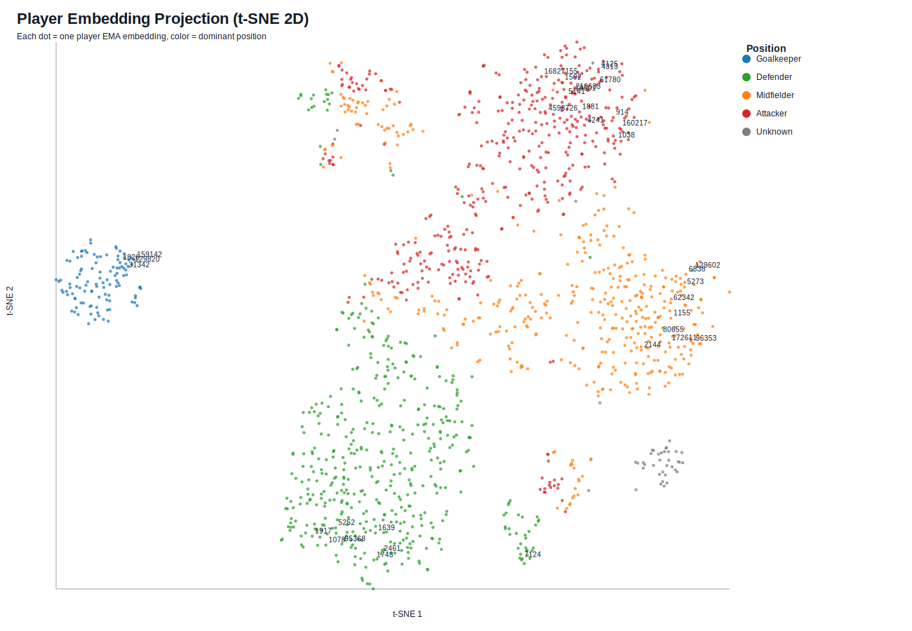

# Temporal Autoencoder Transformer for Football Player Embeddings

This repository trains a **causal Temporal Autoencoder Transformer (TAT)** to produce player-match embeddings and player-level EMA embeddings from fixture history.

## Documentation

- Technical report (math + formulas): [docs/TAT_TECHNICAL_REPORT.md](docs/TAT_TECHNICAL_REPORT.md)
- Package guide: [tat_player_embeddings/README.md](tat_player_embeddings/README.md)

## What The Model Does

Given a player history window, the model learns an embedding vector that captures recent form and style.

Current defaults are designed for pre-match usability:

- Causal attention (`model.causal_attention: true`)
- History cutoff at `t-1` (`sequence.cutoff_shift: -1`)
- No team/opponent identity embeddings
- Position embedding disabled by default
- Mixed-role contrastive negatives (cross-role + in-role)

## Results Showcase

### Interactive t-SNE Projection

The current artifact snapshot includes both a static t-SNE preview and an interactive Plotly export of the player EMA embedding space.

- Interactive HTML: [artifacts/tat/player_embedding_projection_tsne.html](artifacts/tat/player_embedding_projection_tsne.html)
- Projection table: [artifacts/tat/player_embedding_projection_tsne.csv](artifacts/tat/player_embedding_projection_tsne.csv)

[](artifacts/tat/player_embedding_projection_tsne.html)

### Nearest-Neighbour Example: Mohamed Salah

Example query:

```bash
python3 -m tat_player_embeddings.player_neighbors \
  --query "Mohamed Salah" \
  --top-k 5
```

Query player: `Mohamed Salah` (`player_id=4125`, `team=Liverpool`, `n_matches=272`)

| Rank | Neighbour | Team | Cosine similarity |
| --- | --- | --- | ---: |
| 1 | Heung-min Son | Tottenham Hotspur | 0.9776 |
| 2 | Sadio Mane | Liverpool | 0.9639 |
| 3 | Roberto Firmino | Liverpool | 0.9617 |
| 4 | Harry Kane | Tottenham Hotspur | 0.9570 |
| 5 | Raheem Sterling | Manchester City | 0.9535 |

These neighbours come directly from cosine similarity over the exported player EMA embeddings in `artifacts/tat/player_embeddings_ema.csv`.

## Repository Structure

- `data/` raw and processed CSV artifacts
- `tat_player_embeddings/data/` feature building, splitting, scaling
- `tat_player_embeddings/dataset/` sequence/window datasets + corruption
- `tat_player_embeddings/models/` encoder and heads
- `tat_player_embeddings/losses/` reconstruction + contrastive losses
- `tat_player_embeddings/train.py` training entrypoint
- `tat_player_embeddings/eval.py` evaluation entrypoint
- `tat_player_embeddings/embed.py` embedding export
- `tat_player_embeddings/visualize_embeddings.py` PCA projection + SVG plot
- `tat_player_embeddings/configs/tat_base.yaml` default configuration

## Prerequisites

- Python 3.10+
- Recommended: virtual environment

Install dependencies (minimum):

```bash
python3 -m pip install --upgrade pip
python3 -m pip install numpy pandas pyyaml scikit-learn joblib torch
```

Optional:

```bash
python3 -m pip install tensorboard
```

## Data Inputs

Expected raw inputs in `data/`:

- `elo_base_players_understat_with_attacker_ranks.csv`
- `elo_base_fixtures.csv`

## End-to-End Quickstart

### 1) Build features

```bash
python3 -m tat_player_embeddings.data.build_features \
  --config tat_player_embeddings/configs/tat_base.yaml
```

### 2) Create strict time split

```bash
python3 -m tat_player_embeddings.data.make_splits \
  --config tat_player_embeddings/configs/tat_base.yaml
```

### 3) Fit train-only scaler

```bash
python3 -m tat_player_embeddings.data.fit_scalers \
  --config tat_player_embeddings/configs/tat_base.yaml
```

### 4) Train

```bash
python3 -m tat_player_embeddings.train \
  --config tat_player_embeddings/configs/tat_base.yaml \
  --epochs 40 \
  --batch-size 128 \
  --plot-losses \
  --tensorboard
```

### 5) Evaluate

```bash
python3 -m tat_player_embeddings.eval \
  --config tat_player_embeddings/configs/tat_base.yaml \
  --k 10
```

### 6) Export embeddings

```bash
python3 -m tat_player_embeddings.embed \
  --config tat_player_embeddings/configs/tat_base.yaml \
  --split all \
  --write-player-ema
```

By default this exports embeddings from the best checkpoint saved during training:
`artifacts/tat/model.pt` (`output.model_dir` + `output.model_file` in the config).

### 7) Visualize player embeddings

```bash
python3 -m tat_player_embeddings.visualize_embeddings \
  --player-embeddings-csv artifacts/tat/player_embeddings_ema.csv \
  --features-csv data/tat_player_features_with_splits.csv \
  --feature-config-yaml data/tat_feature_config.yaml \
  --output-csv artifacts/tat/player_embedding_projection.csv \
  --output-svg artifacts/tat/player_embedding_projection.svg \
  --output-html artifacts/tat/player_embedding_projection.html
```

Default behavior now writes both PCA and t-SNE projections, including interactive Plotly HTML files with hover cards for player identity, team/season context, match coverage, and aggregated feature summaries:

- PCA: `artifacts/tat/player_embedding_projection.csv`, `artifacts/tat/player_embedding_projection.svg`, `artifacts/tat/player_embedding_projection.html`
- t-SNE: `artifacts/tat/player_embedding_projection_tsne.csv`, `artifacts/tat/player_embedding_projection_tsne.svg`, `artifacts/tat/player_embedding_projection_tsne.html`

### 8) Search player nearest neighbours

```bash
python3 -m tat_player_embeddings.player_neighbors \
  --query "Mohamed Salah" \
  --top-k 10
```

This uses cosine similarity over the exported player EMA embeddings in `artifacts/tat/player_embeddings_ema.csv`.
If a player name is ambiguous, re-run with `--player-id`.

## Training Logs and Monitoring

Training writes the following under `output.model_dir` (default `artifacts/tat/`):

- `train.log`
- `training_history.csv`
- `training_history.jsonl`
- `training_history.json`
- `loss_curves.svg`
- `model.pt`

Monitor live logs:

```bash
tail -f artifacts/tat/train.log
```

Generate/refresh loss plot from saved history:

```bash
python3 -m tat_player_embeddings.plot_training \
  --history artifacts/tat/training_history.csv \
  --output artifacts/tat/loss_curves.svg
```

## Long-Run Command (Background)

```bash
nohup python3 -m tat_player_embeddings.train \
  --config tat_player_embeddings/configs/tat_base.yaml \
  --epochs 40 \
  --batch-size 128 \
  --plot-losses \
  > artifacts/tat/train_stdout.log 2>&1 &
```

## Useful CLI Options

### `train.py`

- `--prepare-data` run feature/split/scaler before training
- `--max-train-batches` / `--max-val-batches` cap batches for smoke tests
- `--plot-losses` write SVG loss curves per epoch
- `--tensorboard` log scalars if TensorBoard is available

### `eval.py`

- `--k` nearest-neighbor size for retrieval metric
- `--max-batches` quick evaluation cap

### `embed.py`

- `--split train,validation,test,all`
- `--from-date` / `--to-date` date filtering
- `--write-player-ema` write one EMA embedding per player

### `player_neighbors.py`

- `--query` case-insensitive player name lookup
- `--player-id` disambiguate duplicate names
- `--top-k` number of neighbours to return
- `--output-csv` optionally save neighbour results

## Main Output Files

- Match embeddings: `artifacts/tat/embeddings.csv`
- Player EMA embeddings: `artifacts/tat/player_embeddings_ema.csv`
- Eval metrics: `artifacts/tat/eval_metrics.json`
- Test embeddings: `artifacts/tat/test_embeddings.csv`
- PCA projection table: `artifacts/tat/player_embedding_projection.csv`
- PCA projection plot: `artifacts/tat/player_embedding_projection.svg`
- PCA interactive plot: `artifacts/tat/player_embedding_projection.html`
- t-SNE projection table: `artifacts/tat/player_embedding_projection_tsne.csv`
- t-SNE projection plot: `artifacts/tat/player_embedding_projection_tsne.svg`
- t-SNE interactive plot: `artifacts/tat/player_embedding_projection_tsne.html`

## Recommended Workflow for Iteration

1. Run a smoke test (`--epochs 1 --max-train-batches 2 --max-val-batches 2`).
2. Run a medium experiment (10-20 epochs).
3. Run full training.
4. Export embeddings and inspect PCA projection.
5. Compare checkpoints with eval metrics and downstream probes.

## Troubleshooting

### Validation loss becomes `NaN`

The current dataset uses right padding with causal attention to avoid fully-masked causal rows. If NaNs appear:

- ensure you are on the latest code,
- check `train.log` for `train_skipped` / `val_skipped` counts,
- run a short smoke test first to verify numerical stability.

### Contrastive loss appears as `0.0000`

Console formatting may hide small values. `train_con` and `val_con` are logged in scientific notation in `train.log` and full precision in `training_history.csv`.

## Configuration

Default hyperparameters are in:

- `tat_player_embeddings/configs/tat_base.yaml`

Recommended to duplicate this file for experiments and change:

- model size (`d_model`, `d_z`, layers, heads)
- corruption probabilities (`p_feature_mask`, `p_match_mask`)
- contrastive weights (`contrastive_cross_role_weight`, `contrastive_in_role_weight`)
- objective mixing (`lambda_contrastive`, warmup)

## Citation/Attribution

If you use this implementation in a report, link the technical specification:

- [docs/TAT_TECHNICAL_REPORT.md](docs/TAT_TECHNICAL_REPORT.md)
